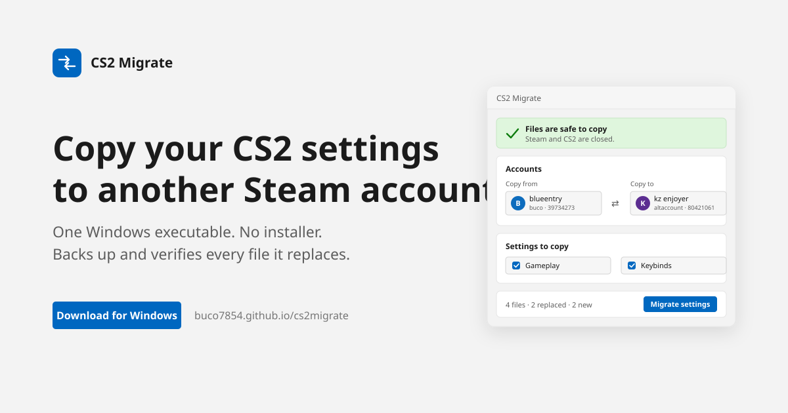

<div align="center">
  
  <h1>CS2 Migrate</h1>
  <p><strong>Move your setup. Keep your edge.</strong></p>
  <p>Safe, visual CS2 settings migration for local Steam accounts.</p>
  <p>
    <a href="https://github.com/Buco7854/cs2migrate/actions/workflows/build-and-pages.yml"></a>
    
    
    
  </p>
  <p>
    <a href="https://buco7854.github.io/cs2migrate/"><strong>Download the latest main build</strong></a>
    ·
    <a href="#how-it-stays-safe">Safety</a>
    ·
    <a href="#build-locally">Build locally</a>
  </p>
</div>

---

CS2 Migrate is a Windows desktop app for safely copying Counter-Strike 2 settings between Steam accounts on the same PC. It discovers Steam and local accounts automatically, shows cached profile pictures when available, previews every file, and publishes as one self-contained executable. The app and download site support English and French with automatic OS/browser detection and a remembered manual override.



## What it migrates

| Category | Recognized files | Typical contents |
| --- | --- | --- |
| Gameplay | `cs2_user_convars_*.vcfg`, `config.cfg` | Sensitivity, crosshair, HUD, gameplay cvars |
| Keybinds | `cs2_user_keys_*.vcfg`, `user_keys*.vcfg` | Keyboard and mouse bindings |
| Video | `cs2_video.txt`, `video.txt` | Resolution and graphics choices |
| Autoexec | `autoexec.cfg` | User-authored startup commands |

Machine-generated settings, unknown files, `steam_autocloud.vdf`, and `remotecache.vdf` are intentionally excluded.

## Quick start

1. Download `CS2Migrate.exe` from **https://buco7854.github.io/cs2migrate/**.
2. Open it—the Steam installation, accounts, language, and locally cached avatars are detected automatically.
3. Pick the source and target, close Steam when prompted, review the file preview, and click **Migrate settings**.

No installation, Steam Web API key, administrator access, or knowledge of CS2 folders is required.

## Friend sessions and account backups

- Enable **Temporary friend session** before migrating onto a borrowed account. The app protects the friend’s exact original state and later changes its main action to **Restore friend’s settings**. Files introduced only for the temporary session are removed during restoration.
- **Back up target** creates a verified snapshot of every recognized portable setting for the selected target account.
- **Restore latest** restores that account’s newest manual snapshot. The current state receives its own safety backup first.
- If Steam Cloud replaces migrated settings, the app detects the hash mismatch and offers to reapply the sealed migration copy after Steam closes.

## How it stays safe

- Steam and CS2 must both be fully closed before writes begin.
- The app asks Steam to exit through `steam.exe -shutdown`; it never force-kills a process.
- Files are staged on the target drive and SHA-256 verified before and after copying.
- Matching target files are backed up under `%LOCALAPPDATA%\CS2Migrate\Backups` with a JSON manifest.
- A verified, sealed copy of the migrated settings is retained outside Steam.
- Only selected, recognized files are replaced. The target folder is never mirrored or emptied.
- If a write or verification fails, changed files are rolled back from the backup.
- Steam Cloud metadata is left untouched. If Cloud restores an older target configuration, the app detects the hash mismatch and offers to reapply the sealed copy after Steam closes.

Steam’s own documentation explains that Auto-Cloud synchronizes configured files when an app launches and exits, and that `steam_autocloud.vdf` is a marker Steam creates in configured locations. That is why this project treats a fully closed Steam client—not metadata deletion—as the safe migration boundary: [Steam Cloud documentation](https://partner.steamgames.com/doc/features/cloud?language=english).

## Zero-setup discovery

On startup, the app reads Steam’s Windows registry entries and then checks the standard installation path. It discovers accounts from `userdata` and enriches them with `config/loginusers.vdf` and locally cached avatars. **Choose Steam folder** appears as a fallback only when automatic detection cannot validate the installation. A manually selected language is remembered; otherwise French is selected for a French Windows UI culture and English is used for every other language.

## Build locally

Requirements: Windows 10/11 and the .NET 10 SDK.

```powershell
dotnet restore CS2Migrate.sln
dotnet test CS2Migrate.sln -c Release
dotnet publish src/CS2Migrate.App/CS2Migrate.App.csproj -c Release -r win-x64 --self-contained true -o publish
```

The output is `publish/CS2Migrate.exe`. It includes the .NET runtime and does not require installation or administrator privileges.

Main-branch builds are not code-signed, so Windows SmartScreen may identify the freshly built executable as an unrecognized app. The site publishes a SHA-256 checksum beside every build for verification.

## Continuous delivery and download site

[`.github/workflows/build-and-pages.yml`](.github/workflows/build-and-pages.yml) runs on each push to `main`, on pull requests, and manually. It:

1. restores, builds, and runs the test suite on `windows-latest`;
2. publishes a compressed, self-contained, single-file `win-x64` executable;
3. uploads the executable and checksum as a workflow artifact;
4. places the same executable into the static site and deploys it to GitHub Pages for main-branch builds.

In the repository settings, set **Pages → Build and deployment → Source** to **GitHub Actions** once. The site will then be available at `https://buco7854.github.io/cs2migrate/` and its download button always points to the most recently deployed successful main build.

## Project layout

```text
src/CS2Migrate.Core/       Steam discovery and safe migration engine
src/CS2Migrate.App/        WPF desktop interface
tests/                     Cross-platform unit/integration tests
docs/                      Static download and documentation site
.github/workflows/         Build, artifact, and Pages deployment
```

## Scope

The current executable targets 64-bit Windows because Steam’s CS2 account data and the requested single-executable GUI are Windows-focused. The core library stays platform-neutral to keep its file-selection and transaction logic easy to test.

Licensed under the [MIT License](LICENSE).
